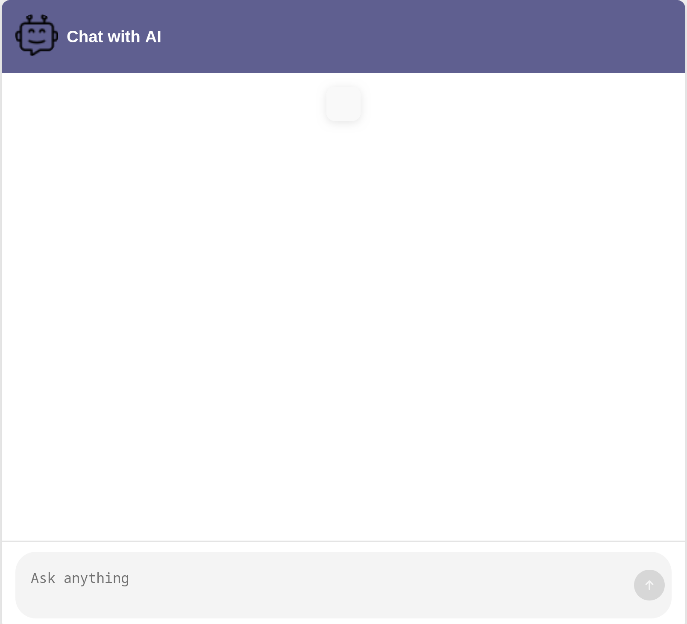
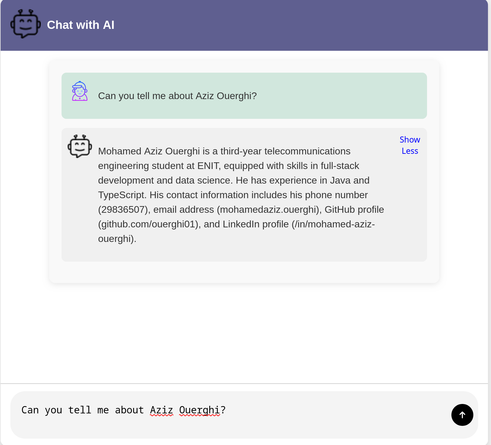

# Agent Bot

## Overview

Agent Bot is an AI-powered assistant that leverages **Retrieval-Augmented Generation (RAG)**, **Cassandra DataStax**, and **FastAPI** to deliver intelligent and scalable responses.

## Features
- **FastAPI**: High-performance API framework.
- **RAG**: Enhances response accuracy using multi-query retrieval with ranker and ensemble retrieval, leveraging LangChain for improved results.
- **Cassandra DataStax**: Scalable NoSQL database for efficient data storage.
- **LLM** Integration: Supports Gemini and Ollama for AI-driven responses.
-**HTMX**: Enhances frontend interactivity for dynamic HTML updates.

## Installation
```bash
# Clone the repository
git clone https://github.com/yourusername/agent-bot.git
cd agent-bot

# Install dependencies
pip install -r requirements.txt
```

## Configuration
Set up your environment variables in a `.env` file:
```env
CASSANDRA_PORT=<your_cassandra_port>
CASSANDRA_HOST=<your_cassandra_host>
KEYSPACE=<your_keyspace>
MODEL_NAME=<your_model_name>
LANGSMITH_API_KEY=<your_langsmith_api_key>
OLLAMA_BASE_URL=<your_ollama_base_url>
UPLOAD_DIR=<your_upload_dir>
MODEL_NAME_EMBEDDING=<your_model_name_embedding>
MODEL_KWARGS=<your_model_kwargs>
ENCODE_KWARGS=<your_encode_kwargs>
UNSTRUCTURED_API_KEY=<your_unstructured_api_key>
ASTRA_DB_ID=<your_astra_db_id>
UNSTRUCTURED_API_URL=<your_unstructured_api_url>
ASTRA_DB_API_ENDPOINT=<your_astra_db_api_endpoint>
ASTRA_DB_APPLICATION_TOKEN=<your_astra_db_application_token>
```

## Running the Application
```bash
uvicorn main:app --host 0.0.0.0 --port 8000
```

## API Endpoints
| Method | Endpoint         | Description          |
|--------|----------------|----------------------|
| GET    | `/`       |    | Get the Main Page
| POST   | `/send_message`        | Get AI-generated response |

## App Screenshots

Below are some screenshots of the app:

### Screenshot 1


### Screenshot 2


## License
MIT License

## Contributors
- **Mohamed Aziz Werghi** - [GitHub](https://github.com/ouerghi01)